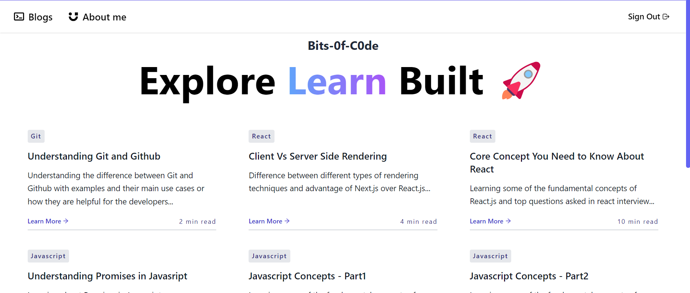

## Bits-0f-C0de

## Writing blogs made easier for everyone!

<h2 align="center">
  <a href="https://ameyiiitblogs.vercel.app/" target="_blank">ameyiiitblogs.vercel.app</a>
</h2>

<div align="center">
  
</div>

<br/>

<center>

[](https://forthebadge.com) &nbsp;
[](https://forthebadge.com) &nbsp;
[](https://forthebadge.com) &nbsp;
[](https://forthebadge.com) &nbsp;

</center>

<h3 align="center">
    🔹
    <a href="https://github.com/soumyajit4419/Bits-0f-C0de/issues">Report Bug</a> &nbsp; &nbsp;
    🔹
    <a href="https://github.com/soumyajit4419/Bits-0f-C0de/issues">Request Feature</a>
</h3>

## Built With

My personal portfolio <a href="http://blogs.soumya-jit.tech/" target="_blank">blogs.soumyajit.tech</a> which features some of my other awesome projects and experiences.<br/>

This project was built using these technologies.

- React.js
- Tailwind Css
- Markdown Render
- Likes and comments
- VsCode
- Vercel

## Features

**🤝 Google authentication**

**📃 Markdown Support**

**✏️ Easy to customize and write posts of your own**

**🎨 Styled with Tailwind Css**

## Getting Started

### 🛠 Installation and Setup Instructions

To get started just clone this repository and backend respository from my github. You will need `node.js` and `git` installed globally on your machine.

Run (For frontend)

```
npm install
```

```
npm run dev
```

Run (For backend)

```
npm install
```

```
npm start
```

Create a `.env` file setup your required environment variables.

Open [http://localhost:3000](http://localhost:3000) with your browser to see the result.

## Usage Instructions

To write your own blogs create a markdown file in `content` folder in backend respository with the specified format.
